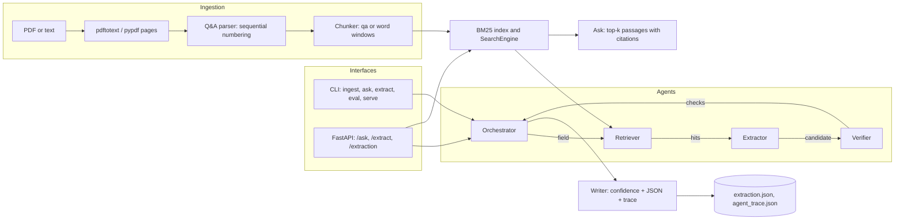

# Architecture

Rendered diagram: `architecture.svg`.

```mermaid
flowchart LR
  subgraph Interfaces
    CLI[CLI: ingest, ask, extract, eval, serve]
    API[FastAPI: /ask, /extract, /extraction]
  end
  subgraph Ingestion
    PDF[PDF or text] --> PAGES[pdftotext / pypdf pages]
    PAGES --> QA[Q&A parser: sequential numbering]
    QA --> CH[Chunker: qa or word windows]
  end
  CH --> IDX[BM25 index and SearchEngine]
  subgraph Agents
    ORC[Orchestrator] -->|field| RET[Retriever]
    RET -->|hits| EXT[Extractor]
    EXT -->|candidate| VER[Verifier]
    VER -->|checks| ORC
  end
  IDX --> RET
  ORC --> WRI[Writer: confidence + JSON + trace]
  WRI --> OUT[(extraction.json, agent_trace.json)]
  CLI --> ORC
  API --> ORC
  API --> IDX
  IDX --> ASK[Ask: top-k passages with citations]
```
